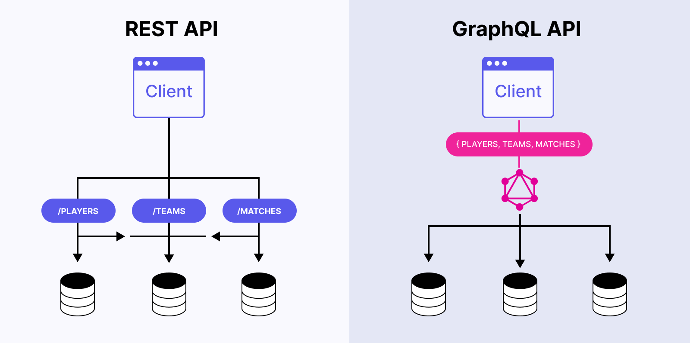
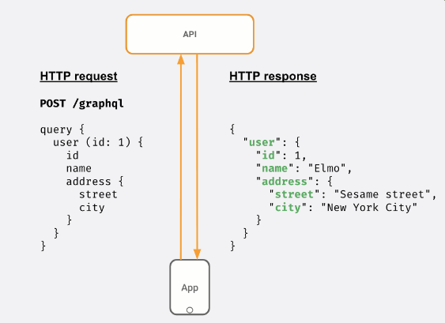

**Виконали:** 
*студенти 2-го курсу, групи ІМ-21(ІМ-23):* 

<span padding-right:5em></span> **Крицька Софія** [Пошта: krytskasofia@gmail.com, [Телеграм](https://t.me/sonakrrr)]

<span padding-right:5em></span> **Рудий Назарій** [Пошта: rudiy.nazaryi@lll.kpi.ua,  [Телеграм](https://t.me/iNazqq)]

**Керівник**

*доцент кафедри ОТ ФІОТ, к.т.н., доцент*<span padding-right:5em></span> **Андрій БОЛДАК** 

[НТУУ "КИЇВСЬКИЙ ПОЛІТЕХНІЧНИЙ ІНСТИТУТ імені ІГОРЯ СІКОРСЬКОГО](https://kpi.ua/)

[Факультет інформатики та обчислювальної техніки](https://fiot.kpi.ua/)

[Кафедра обчислювальної техніки](https://comsys.kpi.ua/)

Київ


# **Порівняння REST API та GraphQL**
<p align="center">
  
</p>


**REST** (Representational State Transfer) та **GraphQL** – це два різні підходи до створення API (Application Programming Interface), які надають можливість взаємодії між різними компонентами програмного забезпечення. У цій доповіді ми розглянемо основні відмінності між REST та GraphQL та їх використання в сучасних веб-додатках.

## Що таке REST API?
<p align="center">
  
</p>

### REST API
REST API (Representational State Transfer Application Programming Interface) є стильовим архітектурним підходом до розробки веб-служб, що базується на стандартах і принципах HTTP. Цей підхід дозволяє створювати легкі, масштабовані та зручні для використання веб-служби. Основними принципами REST є робота з ресурсами (репрезентованими як ресурси в Інтернеті), їх ідентифікація унікальними URI (Uniform Resource Identifier), та взаємодія з ними за допомогою стандартних HTTP-методів, таких як GET, POST, PUT, DELETE.


### Основні характеристики REST API:

 - Архітектурний стиль: REST є стильовим підходом, а не протоколом чи стандартом, що надає більшу гнучкість у розробці та інтеграції.
 - Ресурси та URI: У REST, дані представлені як ресурси, кожен з яких має унікальний ідентифікатор (URI). Ресурси можуть бути, наприклад, об'єктами бази даних або послугами.
 - HTTP-методи: REST використовує стандартні HTTP-методи (GET, POST, PUT, DELETE) для взаємодії з ресурсами. Це спрощує інтерфейс та робить його інтуїтивно зрозумілим.
 - Представлення ресурсів: Ресурси можуть бути представлені у різних форматах, таких як JSON, XML або HTML, залежно від потреб клієнта та сервера.
 - Безстандартність: Клієнт та сервер повинні бути незалежними один від одного, інформація про стан не зберігається на сервері між запитами від клієнта.

### Застосування REST API


REST API (Representational State Transfer Application Programming Interface) широко застосовується в різних проєктах, включаючи веб-додатки, мобільні додатки, системи управління контентом, хмарні сервіси та інтернет речей. Його універсальність та простота взаємодії роблять його зручним для обміну даними між клієнтами та серверами, що полегшує розробку та інтеграцію різноманітних додатків і систем.

## Що таке GraphQL?
<p align="center">
  
</p>

GraphQL - це мова запитів для API, яка була розроблена компанією Facebook у 2012 році і вперше випущена в 2015 році. Вона призначена для ефективного взаємодії між клієнтами і серверами, дозволяючи клієнтам запитувати лише ті дані, які їм потрібні, і нічого зайвого. GraphQL надає більш гнучкий та потужний інтерфейс для взаємодії з сервером порівняно з традиційними REST API.

### Основні концепції GraphQL:

 - Запити та мутації (Queries and Mutations):
   - Запити (Queries): Використовуються для отримання даних з сервера. Клієнт може вказати, які саме дані йому потрібні, а сервер повертає лише ці дані.
   - Мутації (Mutations): Використовуються для зміни даних на сервері. Це може бути оновлення, видалення або створення нових даних.
 - Схема (Schema): GraphQL використовує строго типізовану схему, яка визначає, які дані можуть бути запитані та як можна взаємодіяти з сервером.
 -Резольвери (Resolvers): Резольвери визначають, як саме обробляються запити і мутації. Вони вказують, як отримати необхідні дані з бази даних або інших джерел.
 - Фрагменти (Fragments): Фрагменти дозволяють визначити набір полів, які можна використовувати у різних запитах. Це полегшує управління кодом та підтримку консистентності.

### Застосування GraphQL

GraphQL використовується в різних проєктах, таких як соціальні мережі, електронна комерція, освітні платформи та фінансові сервіси. Його застосування розповсюджується в індустрії розробки програмного забезпечення, спрощуючи взаємодію між фронтендом та бекендом та полегшуючи роботу розробників.

# GraphQL vs. REST:


Ключова відмінність між GraphQL і REST API полягає в тому, що GraphQL є мовою запитів, в той час як REST є архітектурною концепцією для мережевого програмного забезпечення.
Знову ж таки, спосіб передачі даних клієнту полягає в тому, що GraphQL та REST найбільше розходяться. У дизайні REST клієнт надсилає запит HTTP, і дані повертаються як відповідь HTTP. В архітектурі GraphQL клієнт надсилає запити для отримання даних.

## Типові сценарії

### REST API

Припустимо, у вас є API для отримання даних студента. У типовому сценарії REST саме так виглядав би запит/відповідь:
```
// HTTP REQUEST
GET api/students/1 || api/students?id=1

// HTTP RESPONSE
{
   "id": 1
  "name": "john doe",
   "class": 3,
   "age": 11
}
```
У наведеному вище прикладі відповідь на запит, відправлений на сервер, буде об'єктом всіх даних про студента з id 1. Це іноді може зайняти більше часу в залежності від розміру даних через надмірну природу REST

### GraphQL

У GraphQL дані, якщо вони отримані строго перераховуючи кількість необхідних полів. Це обмежує отримання всіх даних одночасно. Розглянемо зображення нижче для отримання даних користувача за допомогою graphQL.

<p align="center">
  
</p>

# Речі, які слід враховувати при виборі між GraphQL і REST

## Безпека

REST API гарантує, що передача даних між двома системами є приватною та незмінною. Веб-токени, які підтримують JavaScript Object Notation (JSON), завершують процес аутентифікації HTTP для безпечної передачі даних з веб-браузерів.

Контроль безпеки GraphQL не настільки розвинений, як у REST. Для того, щоб використовувати поточні функції, такі як перевірка даних в GraphQL, розробники повинні розробити нові методи аутентифікації та авторизації.

## Зручність використання

REST API використовує методи URI та HTTP, які роблять складним для API передбачити, що станеться при зверненні до нової кінцевої точки. Відсутність вказаних вимог до версії в REST дозволяє провайдерам приймати власний метод.
За допомогою GraphQL ви можете надіслати запит до вашого API та отримати точну відповідь без необхідності подальших доповнень. В результаті, надзвичайно передбачувані відповіді від запитів GraphQL пропонують хорошу зручність використання. GraphQL використовує просту методологію і не робить версій API.

## Продуктивність

Розробники можуть отримати дані за допомогою GraphQL лише з одним запитом API. Щоб уникнути недо- і надмірного отримання даних, гнучкий стиль визначає структуру інформаційних запитів і повертає ту саму структуру з сервера.
REST API, на відміну від GraphQL, мають жорсткі структури даних, які можуть спочатку повернути неактуальну інформацію (over-fetching). Оскільки запити вимагають часу, щоб досягти належних даних і надати відповідну інформацію, розробники повинні зробити кілька дзвінків.

## Кеш

Всі кінцеві точки GET для REST API можна кешувати на сервері або через CDN. Вони також можуть зберігатися клієнтом для регулярного використання і кешуватися браузером. GraphQL поставляється через одну кінцеву точку, як правило (/graphql), і відхиляється від специфікації HTTP. В результаті, запити не можуть бути кешовані так само, як REST API.
Однак завдяки наявним інструментам кешування на стороні клієнта перевершує REST. Схема і система типів GraphQL використовуються деякими клієнтами, що використовують кешування шарів (Apollo Client, URQL), що дозволяє їм зберігати кеш на стороні клієнта.

# Особливості REST API vs GraphQL

| Особливості                | REST                                      | GraphQL                                              |
|-----------------------------|-------------------------------------------|------------------------------------------------------|
| Тип                         | Архітектурний стиль                       | Архітектурний стиль                                   |
| Мова запитів для API та сервера баз даних | HTTP методи (GET, POST, PUT, DELETE) | HTTP методи, абстракція графу даних                   |
| Протокол                    | Використовує HTTP методи                  | Використовує HTTP методи, додатковий графовий шар     |
| Структура запитів           | Залежить від URI та HTTP методів          | Гнучке визначення структури даних клієнтом           |
| Передача даних              | Зазвичай JSON чи XML                     | JSON                                                 |
| Кількість запитів           | Кілька ресурсів - кілька запитів          | Один запит може повертати всю необхідну інформацію    |
| Розширюваність              | Залежить від розробки API та версіонування| Забезпечується за допомогою системи типів та можливості додавати нові поля |
| Використання                | Широко використовується в багатьох веб-проєктах | Застосовується там, де потрібна гнучкість та ефективність запитів |
| Запити з боку клієнта       | Обмежений вибором даних сервером         | Клієнт визначає, які дані йому потрібні              |
| Споживання ресурсів         | Може призводити до зайвих запитів на невелику кількість даних | Може уникати надлишкових запитів завдяки гнучкості визначення даних |
| Графова структура           | Не використовує графову структуру даних | Використовує графову структуру для зв'язків між даними |
| Підтримка кешування         | Має обмежену підтримку кешування на рівні HTTP | Підтримує хороше кешування завдяки графовій структурі та заголовкам HTTP |

## Висновок:
REST та GraphQL - два різних підходи до створення API. REST використовує стильовий підхід та є універсальним для різних проєктів, використовуючи стандарти HTTP. GraphQL, розроблений Facebook, пропонує гнучкий інтерфейс для точного визначення потрібних даних.

При виборі між REST та GraphQL слід враховувати безпеку, зручність використання, продуктивність та кешування. REST гарантує безпеку через аутентифікацію HTTP, а GraphQL може бути зручнішим для розробників. У продуктивності GraphQL може бути ефективнішим, забезпечуючи точне отримання даних. Обирайте між ними залежно від потреб вашого проєкту, враховуючи їхні переваги та застосування.


